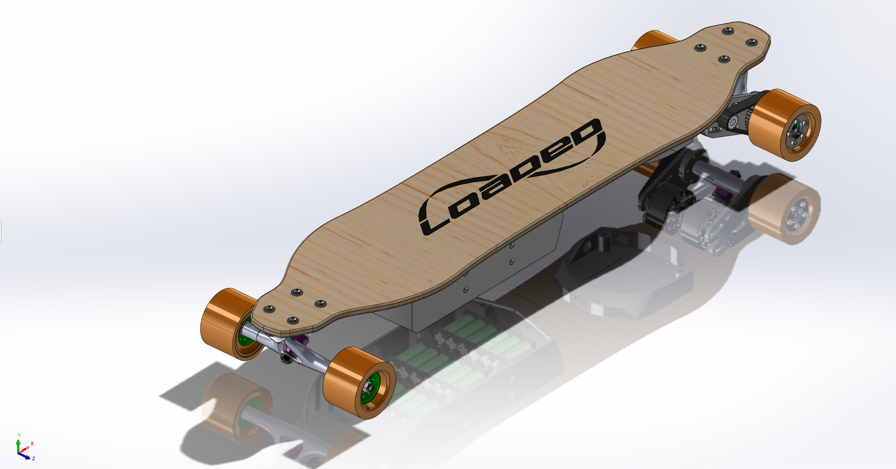

# ElectricLongBoard

Welcome to my electric longboard project. It is currently ongoing, and here is where you will find all the work that I have comepleted so far.

Format: 

### Mechanical
I have only uploaded here the first version, and although version 1 worked no problem, and I logged about 120km on this setup, it ultimatly failed, and failed in a way that could have hurt quite a bit. So I decided to do an entire overhaul of the motor mount and trucks. 

What is currently in development

### Electrical

### Other Notes